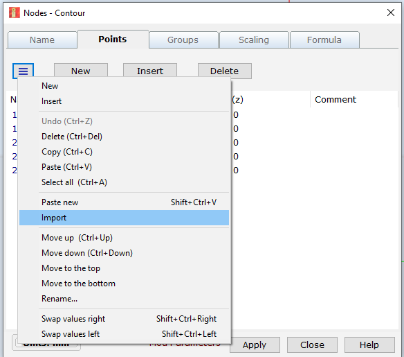

# Circular symetric simulations in AKABAK3

## Introduction

This document contains notes on circular symetrical simulations

## Specifying geomatry

Geomatry is specified with the x axis the axial direction and the y axis the radial direction, the z axis is un-used.  A nodes .txt file can be loaded from the general tab->nodes dialog.

The .txt file has the following format:

    Nodes "Nodes"
      Scale=1m
         1    0.000   0.2000	
         2    0.200   0.3000
         3    0.500   0.4000
         4    1.000   0.5000
The scale can be m, mm etc. The first column is the node number, the second column is the x cordiante and the last column is the radial cordinate.  In theory a .dxf can also be revolved around the x axis (as done in the example CS IB-Bullet-Horn DXF) however this is very buggy with corupted imports from every software I tried.  

Once the nodes are loaded elments can be created by copying in a file of the following format:

    101,  "1 2"
    102,  "2 3"
    103,  "3 4"
The elements are created between the nodes using the elements - nodes dialog in the BEM tab.  

## Infinite bafffle sim settings:

* horn mouth ends at x=0 (all horn cordinates in negative x)
* Infinite baffle component in exterior domain with pos direction
* Interface; subdomain 1 internal domain and subdomain 2 exterior 
* Normals pointed such that looking out from the horn throat the interface is shown
* Remeber to turn on fixed driving if not including a LEM model
* Image of BEM setup [here](./media/horn_BEM.png)
