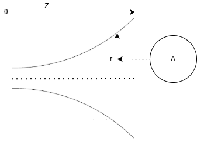
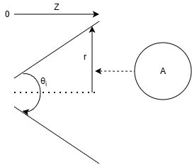

# BCE horns

## Introduction

The aim of this work is to develop a horn contour for midrange horns that has an improved throat acoustic impedance characteristic compared to a conical horn, while still displaying constant directivity characteristics in the frequency band of interest.  To ease construction this horn contour will consist of three sections: throat, middle conical section and the mouth section.  The middle section will be conical to have flat walls, considerably easing construction complexity.  The mouth section will not be considered in this document but is of interest in future work for freestanding horns.    

For ease of comparison of the contours we consider only the simplest case of two section (throat and middle) axisymmetric (round) horns.  For simulation of impedance the finite horns will be terminated in acoustic absorber to eliminate mouth effects.  For assessment of high frequency directivity infinite baffle simulations will be conducted.  Four horns are the compared: conic, exponential, conic-exponential (CE) and the contour proposed in this work, blended conic-exponential (BCE).  

## Exponential horn:

For an exponential horn with cross sectional area, $A$ and cross sectional radius, $r$:

$$
\begin{align}
A(z)=A_0e^{k_ez}
\end{align}
$$

$$
\begin{align}
r(z) = \sqrt{\frac{A(z)}{\pi}} = \sqrt{\frac{A_{0}}{\pi}} e^{\cfrac{k_{e} z}{2}}
\end{align}
$$

$$
\begin{align}
k_e = \frac{4\pi f_c}{C}
\end{align}
$$

Where $f_c$ is the exponential horn cutoff frequency and C the speed of sound ($343 ms^{-1}$ at $20\degree C$ and at sea level).  For the exponential horn the cutoff frequency is constant over the whole length of the horn.  The area expansion rate is exponential:

$$
\begin{align}
\frac{\text{d}A}{\text{d}z} = A_0k_ee^{k_ez}
\end{align}
$$

## Hyperbolic horn (hypex):

These are similar to the exponential case with an additional parameter, $t$, which controls the horn shape:  

$$
\begin{align}
A(z) = A_0\left(\cosh\left(\frac{k_ez}{2}\right)+t\sinh\left(\frac{k_ez}{2}\right)\right)^2 
\end{align}
$$

For $t = 1$ the equation reduces to the exponential case:

$$
\begin{align}
A(z)_{t=1} = A_0\left( \cfrac{e^{\cfrac{k_ez}{2}}+e^{-\cfrac{k_ez}{2}}}{2} + \cfrac{e^{\cfrac{k_ez}{2}}-e^{-\cfrac{k_ez}{2}}}{2}  \right)^2
\end{align}
$$

$$
\begin{align}
A(z)_{t=1} = A_0e^{k_ez}
\end{align}
$$

Values of $t$, less than 1 result in sharper a sharper cut-off but better loading to that cut-off.  Keele often uses a value of $t=0.6$. For a axisymmetric horn the radius is: 

$$
\begin{align}
r(z) = \sqrt{\frac{A(z)}{\pi}}
\end{align}
$$

$$
\begin{align}
r(z) = \sqrt{\frac{A(0)}{\pi}}\left(\cosh\left(\frac{k_ez}{2}\right)+t\sinh\left(\frac{k_ez}{2}\right)\right)
\end{align}
$$

## Conic horn:

The horn contour is considered for axisymmetric conical horns with cross sectional area $A$, included angle $\theta_i$ and cross section radius, $r$:

$$
\begin{align}
r(z) = r_0+z\tan\left(\frac{\theta_i}{2}\right)
\end{align}
$$

$$
\begin{align}
A_0 = \pi (r_0)^2
\end{align}
$$

$$
\begin{align}
r(z) = \sqrt\frac{A_0}{\pi}+z\tan\left(\frac{\theta_i}{2}\right)
\end{align}
$$

$$
\begin{align}
A(z) = \pi r^2 = \pi\left(\frac{A_0}{\pi}+2z\tan\left(\frac{\theta_i}{2}\right)\sqrt\frac{A_0}{\pi}+z^2\tan^2\left(\frac{\theta_i}{2}\right)\right)
\end{align}
$$

Therefore Let:

$$
\begin{align}
A(z) = A_0 + k_{C1}z+k_{C2}z^2
\end{align}
$$

$$
\begin{align}
k_{C1} = 2\pi\tan{\left(\frac{\theta_i}{2}\right)}\sqrt{\frac{A_0}{\pi}} = \tan{\left(\frac{\theta_i}{2}\right)}\sqrt{4\pi A_0}
\end{align}
$$

$$
\begin{align}
k_{C2} = \pi\tan^2\left(\frac{\theta_i}{2}\right)
\end{align}
$$

The area expansion rate of the conic horn is therefore:

$$
\begin{align}
\frac{\text{d}A}{\text{d}z} = k_{C1}+2k_{C2}z
\end{align}
$$

The area expansion rate of the horn is increasing as we move away from the throat towards the mouth, but is not equal to the exponential expansion rate.  This introduces an area expansion rate discontinuity if a conical horn section is directly joined to a exponential horn section.

## Keele CE horns 

These horns are described in the paper ["WHAT'S SO SACRED ABOUT EXPONENTIAL HORNS?", D. B. KEELE, JR., 1975](https://dbkeele.com/7-whats-so-sacred-about-exponential-horns/).  The basic idea to be to improve the low frequency loading of constant directivity horns by joining an exponential or hyperbolic throat to a conical horn.

### Exponential throat to conic:

For this horn type the throat horn contour is the exponential type which is smoothly joined to a conical horn by matching the wall angle.  From equation (2):

$$
\begin{align}
r_{exp}(z) = \sqrt{\frac{A_0}{\pi}}e^{\frac{1}{2}k_ez}
\end{align}
$$

$$
\begin{align}
\frac{\text{d}r_{exp}}{\text{d}z} = \frac{k_e}{2}\sqrt{\frac{A_0}{\pi}}e^{\frac{1}{2}k_ez}
\end{align}
$$

and for the conic horn, from its radius equation:

$$
\begin{align}
\frac{\text{d}r_{conic}}{\text{d}z} = \tan\left(\frac{\theta_i}{2}\right)
\end{align}
$$

therefore the joining point is at:

$$
\begin{align}
\frac{\text{d}r_{exp}}{\text{d}z} = \frac{\text{d}r_{conic}}{\text{d}z}
\end{align}
$$

solving for z, at this point:

$$
\begin{align}
z_{join\_exp} = \frac{\ln{\left(\frac{4 \pi}{A_{0} k_{e}^{2}} \right)} + 2 \ln{\left(\tan{\left(\frac{\theta_{i}}{2} \right)} \right)}}{k_{e}}
\end{align}
$$

When plotting the combined horn the conic section starts from $z=z_{join\_exp}$, this point is effectively the new throat of the conic horn.  Therefore the conic section can be plot using the following equations:

$$
\begin{align}
A(z_{join\_exp})=A_0e^{k_e z_{join\_exp}}
\end{align}
$$

$$
\begin{align}
k_{C1} = \tan{\left(\frac{\theta_i}{2}\right)}\sqrt{4\pi A(z_{join\_exp})}
\end{align}
$$

$$
\begin{align}
A_{CE\_conic}(z) = A_0 + k_{C1}(z-z_{join\_exp})+k_{C2}(z-z_{join\_exp})^2
\end{align}
$$

The exponential throat is as per the exponential horn area equation, horn radii are trivial to calculate from the area.

### Hyperbolic throat to conic:

A a complication is that hyperbolic throats are used in most of Keele's examples.  Solving the hyperbolic radius equation in the same manner:

$$
\begin{align}
\frac{\text{d}r_{hypex}}{\text{d}z} = \frac{\text{d}r_{conic}}{\text{d}z}
\end{align}
$$

$$
\begin{align}
z_{join\_hypex} = \frac{\log{\left(\cfrac{- A_{0} k^{2} t^{2} + A_{0} k^{2} + 4 \sqrt{\pi} \sqrt{- A_{0} k^{2} t^{2} + A_{0} k^{2} + 4 \pi \tan^{2}{\left(\frac{\theta_{i}}{2} \right)}} \tan{\left(\frac{\theta_{i}}{2} \right)} + 8 \pi \tan^{2}{\left(\frac{\theta_{i}}{2} \right)}}{A_{0} k^{2} \left(t^{2} + 2 t + 1\right)} \right)}}{k}
\end{align}
$$

### Example

Taking Keele's round axi-symetric example horn C1+ with the following parameters: $f_c = 360 Hz$, $t=0.6$, $r_0=12.446 mm$ and $\theta_i = 108.2\degree$, we can plot the wall contour and area:

??? figures

However if we examine the area with respect to the distance from the throat we see a discontinuity in the area expansion.  As an example the 60 x 40 horn HR6040 sketch from Keele's paper is plot:

(show discontinuity example)

It is observed that the area expansion is discontinuous.

## BCE horn:

In an effort to have both a smooth area expansion and a smooth wall contour we can define a linear blend of the two horns over length, $L_b$, reverting to the conventional conical form beyond the blended section (BCE horn):

$$
\begin{align}
A = \left(\frac{z}{L_b}\right)A_{c}+\left(1-\frac{z}{L_b}\right)A_{e}
\end{align}
$$

$$
\begin{align}
A(z) =
\begin{cases}
\left(\frac{z}{L_b}\right)(A_0+k_{C1}z+k_{C2}z^2)+\left(1-\frac{z}{L_b}\right)A_0e^{k_ez} & \text{if $z\le L_b$} \\
A_0+k_{C1}z+k_{C2}z^2 & \text{if $z > L_b$} \\
\end{cases} 
\end{align}
$$

We can obtain an approximation of length $L_b$, by the using the diameter of the horn at length $L_b$ from the throat.  We can assume the horn is a round piston and constrain the diameter of this piston such that beaming begins at $f_b$, where $f_b$ is the upper frequency limit of our constant directivity behavior.  The choice of this frequency is a balance between loading and usable bandwidth of the horn for off axis listeners. The book [P.G 576-577 High Quality Horn Loudspeaker Systems: History, Theory and Design, 2019, Kolbrek and Thomas (first edition)](https://hornspeakersystems.info/), gives the equation:

$$
\begin{align}
D_t = \frac{K_{t,r}}{\sin\left(\frac{\theta_i}{2}\right)f_b}
\end{align}
$$

Several values are given for the $K_{t,r}$ constant:

(Values)

We also should impose the critera that the gradient of the exponential section doesn't go more positive than the conic or you get a weird inflection point!